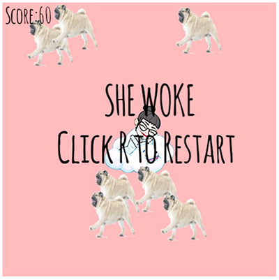

# PUG ATTACK

A simple game based on my friend and her pug.

## Motivation

I am taking a rust vs go class and wanted to take a project based approach to learning rust. 

## How to run it

You need to have Rust and Cargo installed. Then run

cargo build 
cargo run